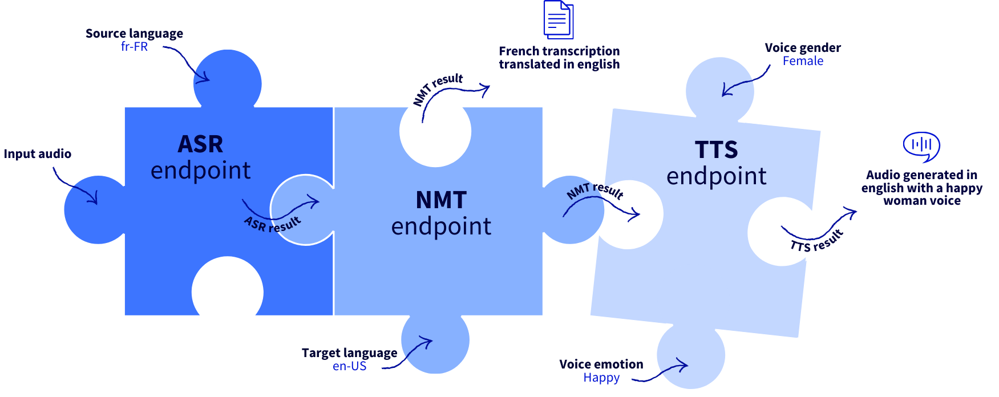
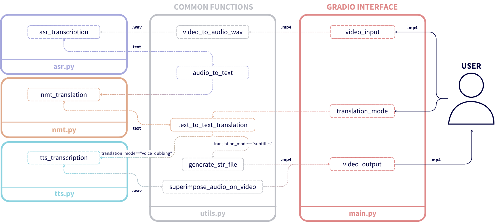

# OVHcloud SPEECH AI WORKSHOP

*Master Speech AI APIs to enhance your applications!*

This workshop allows you to to **master Speech AI** by creating a **Video Translator** web app with [AI Endpoints](https://endpoints.ai.cloud.ovh.net/).

## Concept

By the end of this Hands-On Lab, you'll be able to:

    - Master Speech AI APIs, including Automatic Speech Recognition (ASR), Neural Machine Translation (NMT), and Text-to-Speech (TTS).
    - Transcribe audio or video recordings using ASR.
    - Translate transcribed text into another language using NMT.
    - Synthesize translated text using TTS to modify the spoken language of the original video.
    - Build a powerful web app that combines these steps, so you can subtitle and dub voices of any video !



## Get started with Speech AI

To get started with the workshop, open the `notebooks/0_SPEECH_AI_BASICS.ipynb` notebook to learn about Speech AI basics and see examples of how to use ASR, NMT, and TTS endpoints.

## Focus on key features

Once you've learned the basics of Speech AI, you'll learn about some key features that make it even more powerful. You will learn how to:

- Generate SRT files from ASR model output.
- Take silences into account during translation using the NMT model.
- Synthesize the translated text to voice dub the original video, using the TTS model.

## Build a video translator web app

Now it's time to put this knowledge into practice by building a **Video Translator web app**, which will integrate ASR, NMT, and TTS endpoints to enable you to transcribe, translate, and dub videos in real-time.



## Deploy the app with OVHcloud AI Deploy

> Don't forget to replace `<ai-endpoints-api-token>` by your access token in `ovhai` deployment command!

### 1. Create the Dockerfile

Create the `Dockerfile` as follow:

```
FROM python:3.11

WORKDIR /workspace
ADD . /workspace

RUN apt-get update && apt-get install -y ffmpeg libsndfile1-dev
RUN pip install -r requirements.txt

RUN chown -R 42420:42420 /workspace
ENV HOME=/workspace
CMD [ "python3" , "/workspace/main.py" ]
```

### 2. Build the Docker image:

Build the Docker image:

`docker build . -t speech-ai-video-translator-app:v1.0.2`

Tag and push the Docker image on Docker Hub:

`docker tag speech-ai-video-translator-app:v1.0.2 eleapttn/speech-ai-video-translator-app:v1.0.2`
`docker push eleapttn/speech-ai-video-translator-app:v1.0.2`

## 3. Launch Video Translator app

```
ovhai app run \                                    
    --name VideoTranslatorApp \
    --cpu 12 \
    --default-http-port 8000 \
    --volume standalone:/tmp/gradio:rw \
    --env ASR_FR_FR_ENDPOINT=https://nvr-asr-fr-fr.endpoints.kepler.ai.cloud.ovh.net/api/v1/asr/recognize \
    --env NMT_EN_FR_ENDPOINT=https://nvr-nmt-en-fr.endpoints.kepler.ai.cloud.ovh.net/api/v1/nmt/translate_text \
    --env TTS_EN_US_ENDPOINT=https://nvr-tts-en-us.endpoints.kepler.ai.cloud.ovh.net/api/v1/tts/text_to_audio \
    --env OVH_AI_ENDPOINTS_ACCESS_TOKEN=<ai-endpoints-api-token> \
    --unsecure-http \
    eleapttn/speech-ai-video-translator-app:v1.0.2
```

> Access the web app on the following link: **[https://bit.ly/video-translator-devoxx](https://bit.ly/video-translator-devoxx)**

## References

To go further with Speech AI, refer to the following links.

### AI Endpoints

- [AI Endpoints website](https://endpoints.ai.cloud.ovh.net/)

### Slides

- [Mastering Speech AI APIs presentation](https://www.canva.com/design/DAGQoCH-u9A/48MFjrelitPQGktd3avn-w/view?utm_content=DAGQoCH-u9A&utm_campaign=designshare&utm_medium=link&utm_source=editor)

### GitHub repositories

- [Some AI Endpoints examples](https://github.com/ovh/public-cloud-examples/tree/main/ai/ai-endpoints)

### Blog articles

- [How to build a video translator app using AI Endpoints](https://blog.ovhcloud.com/master-speech-ai-and-build-your-own-video-translator-app-with-ai-endpoints/)
- [Build a Powerful Audio Virtual Assistant with AI Endpoints](https://blog.ovhcloud.com/build-a-powerful-audio-virtual-assistant-with-ai-endpoints/)
- [Create an audio summarizer assistant with AI Endpoints](https://blog.ovhcloud.com/create-audio-summarizer-assistant-with-ai-endpoints/)
- [Build and deploy a Speech-To-Text Application using an AI model and AI Deploy](https://blog.ovhcloud.com/how-to-build-a-speech-to-text-application-with-python-1-3/)

