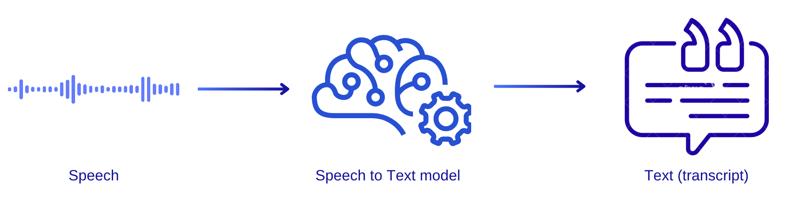

# ASR (Automatic Speech Recognition)

**Automatic Speech Recognition** is a technology that converts spoken language into written text. It is a complex process that involves several stages, including speech signal
preprocessing, feature extraction, acoustic modeling, language modeling, and speech recognition engine.

**[AI Endpoints](https://endpoints.ai.cloud.ovh.net/)** makes it easy to use it, with ready-to-use inference APIs. Indeed, the **ASR** API endpoint allows you to recognize and transcribe audio, especially human speech, into text, in a few seconds.



## How to use the ASR API Endpoint

The ASR API endpoint is based on an ASR model developed by [NVIDIA](https://www.nvidia.com/en-gb/). AI endpoints offers you a wide range of transcription options for several languages (English, French, German, Italian, Spanish, and Chinese). 

The following example will allow you to translate **english** (GB) audio files. It will return the sentence transcribed by the model.

> :WARNING: **Make sure to enter a valid audio file path (replace <audio_file> by an existing one. You can find an audio sample in the `audio_samples` folder.**

```python

# Import the requests and os libraries into your notebook environment, if not already done
import requests
import os

# Specify the headers of your request 
# We will expect a JSON as the output, since the ASR model will generate text.
headers = {
    'accept': 'application/json',
    "Authorization": f"Bearer {os.environ.get('OVH_AI_ENDPOINTS_ACCESS_TOKEN')}",
}

# Specify the audio file to be uploaded and transcribed
files = [
    ('audio', open('<audio_file>', 'rb')),
]

# Send the request to the correct model endpoint and get response 
# Here we use the "en-gb" version, which is meant for English audio files.
response = requests.post(
    os.getenv("ASR_EN_GB_ENDPOINT"), 
    files=files, 
    headers=headers
)

# Return complete transcription
if response.status_code == 200:
    response_data = response.json()
    resp=''
    for alternative in response_data:
        resp+=alternative['alternatives'][0]['transcript']
    print("Audio transcription in english:\n", resp)
else:
    print("Error:", response.status_code)
```

## References

For more information about the ASR model features, please refer to RIVA ASR (documentation)[https://docs.nvidia.com/deeplearning/riva/user-guide/docs/asr/asr-overview.html].